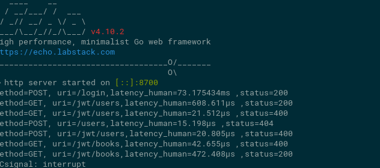
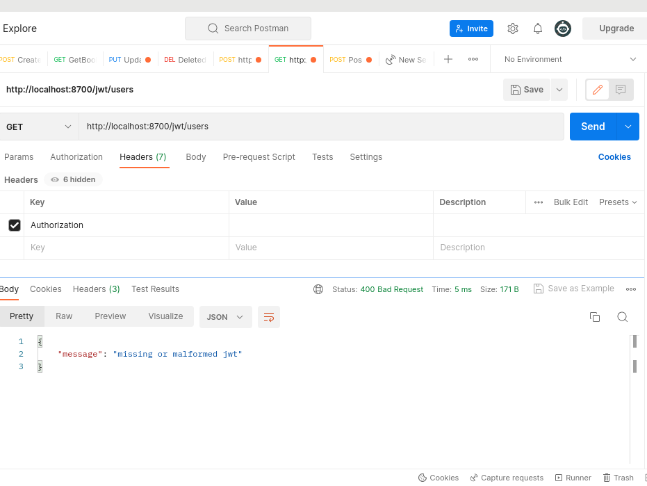
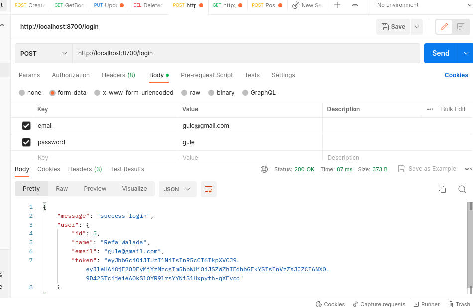
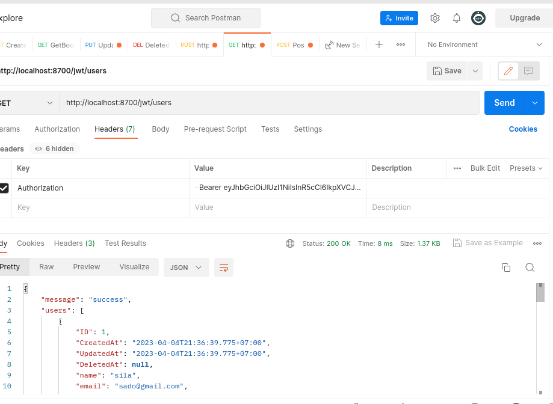
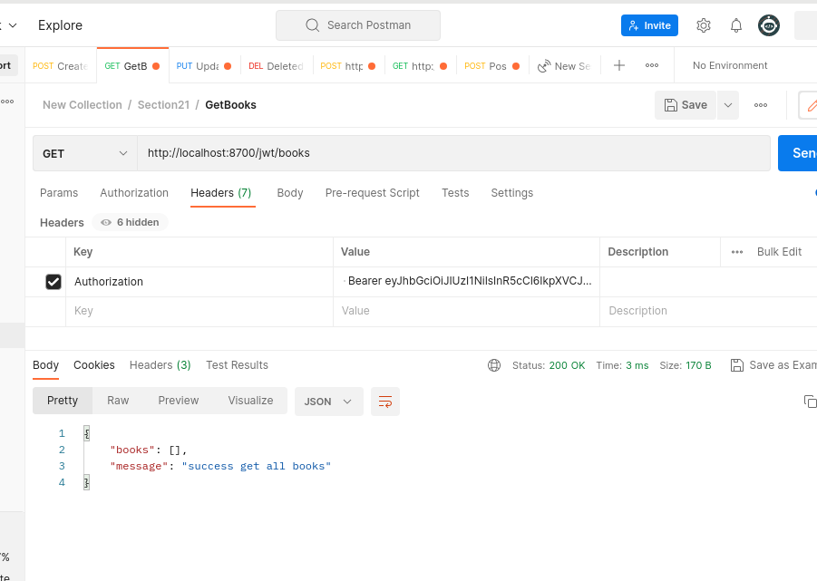

# Section 22: Middleware
## Praktikum Middleware
### Soal
- Pada tugas sebelumnya yang telah dikerjakan (@16 - Soal ORM & Code Structure (MVC)), tambahkan log middleware.
     

- Tambahkan middleware untuk melakukan autentikasi dengan menggunakan JWT. Rincian endpoint adalah sebagai berikut:
- ketika users tidak login
     
- ketika users melakukan login maka akan mendapatkan sebuah return dari bearer yang telah di buat di sini saya membuat explorisasi dengan membuat password menjadi hash 
     
- dan berikut adalah sample users ketika sudah login menggunakan token yang di generate
     
- dan beriku adalah endpoint book yang sudah saya kasih middleware
    

 # Sumarry

1. Middleware di Golang adalah fungsi yang memproses permintaan HTTP sebelum atau setelah ditangani oleh handler.
2. Middleware membantu memisahkan tugas-tugas tertentu seperti otentikasi, otorisasi, logging, dan pengukuran kinerja dari kode aplikasi utama.
3. Middleware di Golang disusun dalam rangkaian dan dijalankan secara urut.
4. Middleware dapat ditambahkan menggunakan wrapper atau diimplementasikan sebagai fungsi.
5. Di praktikum kali ini saya menggunakan middleware dari bawaan echo.
6. Middleware yang umum digunakan dalam Golang adalah autentikasi, otorisasi, penanganan kesalahan, logging, pemrosesan input dan output, kompresi data, dan mempercepat respons HTTP.

ada 3 hal yang saya pelajri salah satunya
1. saya bisa menggunakan middleware
2. kemudahan implementasi middlware di golang
3. cara pengamanan data di golang